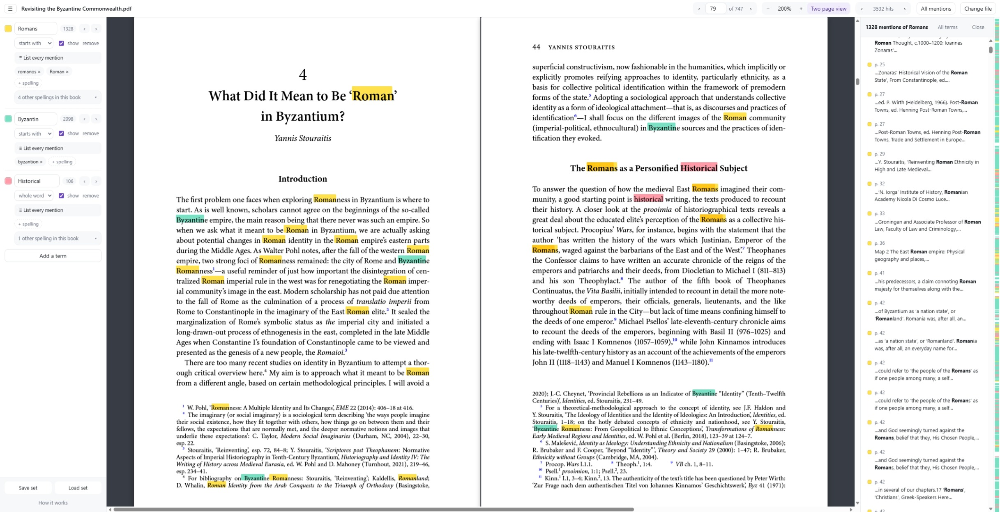
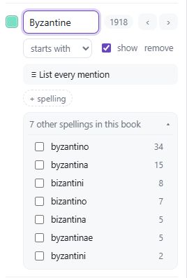
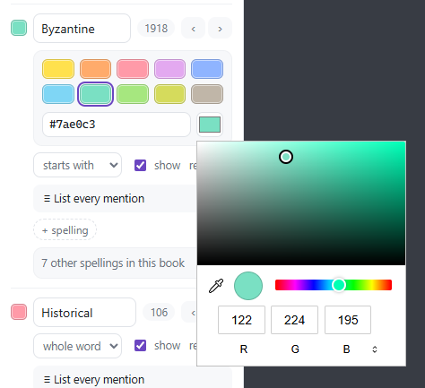
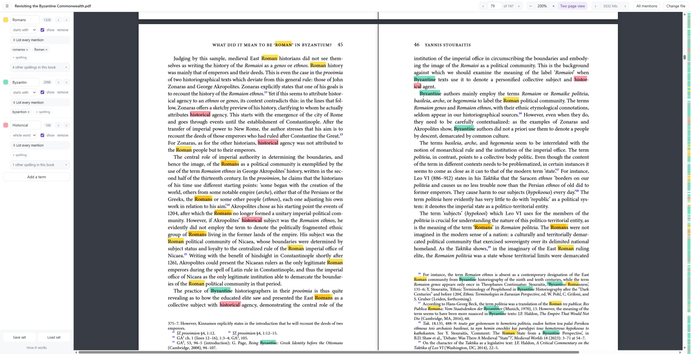

# Research PDF Reader

Search a book for as many names as you like at once, each in its own colour, and
every spelling of each. In your browser, with nothing uploaded and no page limit.

Reading a long book for a handful of names is the same work over and over. The find
box takes one word at a time, tells you nothing about where in the book that word is
dense, and knows only the spelling you typed, which is no use at all when the same
family is *Modich* on one page, *Modycz* on another and *Mwdych* in the index. This
reads the book once and then answers all of those questions at the same time.

- **Many terms at once**, each its own colour, on the page together. A family name in
  yellow beside a place in red beside a concept in green is the normal way to work.
- **Every spelling the book actually contains.** Under each term is a list of the
  variants that occur in *that book*, with their counts. Tick the ones that belong and
  they are counted and coloured as one term.
- **Declension handled**, because *starts with* is the default: *Modich* finds
  *Modicha* and *Modichem* without finding *quo modi*.
- **A name broken across a line is found whole** and highlighted on both lines, which
  is where an ordinary find box loses hits.
- **The whole book at a glance** in a strip down the right edge, one tick per hit in
  its term's colour. Where two colours meet, both names are on that page.
- **Every mention in one list**, in reading order, with its page number and half a
  line of context either side.
- **Nothing is uploaded.** No server, no account, no upload, no limit on how big the
  book is.

**&rarr; [Open Research PDF Reader](https://it-stoic.github.io/research-pdf-reader/)**



## Your book has to be OCR'd first

**This does not recognise text. It searches text that is already in the file.**

A PDF made by a scanner is a stack of photographs. There are no words in it, only
pictures of words, and nothing can search that. Open such a file here and the app says
so and stops rather than pretending.

So run the book through OCR first, then open the result here. We recommend
**[gImageReader](https://github.com/manisandro/gimagereader)**, a free front end to
Tesseract that runs on Windows and Linux, reads PDFs directly, and writes a searchable
PDF back out with the pictures untouched and the recognised text laid invisibly behind
them. That is exactly the kind of file this app wants. It reads well beyond English
too: over a hundred languages, smaller ones such as Croatian and Slovenian among
them, and long dead ones such as Latin.

If your scan is grey, shadowed along the gutter and speckled, clean it before OCR
rather than after, because OCR reads a clean page far better than a dirty one. Two
sibling tools do that, in the browser, with nothing uploaded:

- **[Book Scan Splitter](https://github.com/it-stoic/book-scan-splitter)** — cuts
  two-page sheets apart and straightens them.
- **[Book Scan Cleaner](https://github.com/it-stoic/book-scan-cleaner)** — whitens the
  paper, lifts the gutter shadow and takes the scanner's dust off.

The order that works: **split → clean → OCR → read here.**

## Use it

1. Open the link above.
2. Drop your PDF on the page. It is read once, on your machine.
3. Type a name in the first row. Every occurrence lights up, and the number beside the
   row is how often it occurs in the whole book.
4. Look under the row at **other spellings in this book** and tick the ones that are
   the same name.
5. **Add a term** for the next name, and so on, as many as you want.
6. Walk the hits with **‹ ›** beside the count, or Ctrl+Shift+Left and
   Ctrl+Shift+Right, or open **All mentions** and read them as a list.

## How a term is matched

Case and diacritics never count: `Modić`, `modic` and `MODIĆ` are one and the same.
What you choose per row is how much of a word has to match.

| Mode | Finds | Does not find |
| --- | --- | --- |
| **starts with** (the default) | *Modich*, *Modicha*, *Modichem* | *quo modi*, *deModich* |
| **whole word** | *Modich* | *Modicha* |
| **anywhere** | *Modich*, *Modicha*, *deModich* | — |

The choice matters more than it looks. *modi* is the genitive of *modus* and stands on
nearly every page of a charter collection, so searching for it *anywhere* returns
hundreds of hits of which a handful are the family. *Starts with* is the default
because it is the one that handles Latin declension without dragging that in.

## Spellings

The same name is not spelled the same way twice in a medieval source, and OCR adds a
second layer of drift on top of the scribe's. So under each term the app offers the
forms **the book itself contains**, with their counts, and you decide which belong.

<p align="center">
  
</p>

The list is not a guess at what a word might look like. Nothing is invented: a form no
page carries is never offered. What is offered comes from the orthography of Latin
charters — w, u and v as one letter, y for i, ch, cz, cs and ty for c, th for t, a
doubled consonant for a single one — and beyond that only a letter that stands in for
another may differ. That is either a vowel for a vowel, which is the scribe, or a pair
a reading engine mixes up, which is the OCR. A difference at the very first letter is
real but rarer, so those are offered last. An ending never counts, because *starts
with* already covers it.

The point of the rule is what it refuses. *Mudich* and *Nodich* are offered for
*Modich*; *woman* is not offered for *Roman*.

What the list does not offer, type yourself with **+ spelling**. *Roma* and *Rome*
under one colour is a normal way to work, and so is a modern form beside its Latin one.
Click a spelling to drop it again.

## Colours

Ten colours sit on the palette, and any other colour is one click further, by wheel or
by hex. Pick colours that survive being next to each other, because on a dense page
they will be.

<p align="center">
  
</p>

## Reading

Every occurrence of every showing term is highlighted at once, and a name the
typesetter broke across a line is highlighted whole, on both lines: *histor-* at the
end of one and *ical* at the start of the next is one hit, not two and not none.



The strip down the right edge is the entire book compressed to the height of the
window, one tick per hit in its term's colour. It is the fastest way to see that a name
is dense in two chapters and absent from the rest, and clicking it goes there.

**All mentions** opens a panel holding every hit of every showing term, in reading
order, each with its page number and half a line either side. The **≡** beside a term
narrows the panel to that term alone, its added spellings included. Click a line and
the page opens at it. It is the way to read what a name is doing across a book without
scrolling for it.

The pages themselves behave the way pages should: fit or a zoom you choose, Ctrl and
the wheel, one page or two side by side. Books whose pages are not all one size are
handled properly, so a folded map or a landscape plate sits in the spread at its own
scale instead of pushing every other page off the spine. The text is real text as well
— select it and copy it and you get words, not a picture.

## Sets

**Save set** writes your rows to a small `.json` file: the terms, their colours, their
match modes and the spellings you ticked. Load it on the next volume of the same
edition, or send it to a colleague so you are both searching the same thing the same
way.

## What it will not do

**It will not recognise text.** If the pages are pictures, it says so and stops. See
[above](#your-book-has-to-be-ocrd-first).

**It will not fix bad OCR.** It offers you the variants that are in the file, which is
a real help when the recognition was decent and merely drifting. If the recognition was
poor, the words on the page are not the words in the file, and no search can reach
them. Better scans and a better OCR pass are the only cure.

**It will not write to your PDF.** The highlighting is on screen only. Your file is
opened, read and never touched.

**It will not remember anything.** Close the tab and the book, the terms and the
colours are gone. That is the privacy property seen from the other side: save a set if
you want to come back to it.

## Is my book uploaded anywhere?

No, and there is nowhere for it to go. The page has no server behind it, no account, no
analytics and no storage. It makes no network request at all once it has loaded. Turn
off your network before dropping the file and everything works exactly the same, which
is the test worth doing if you would rather check than be told.

This matters more here than it looks. An unpublished edition, an archive's scan under
embargo, a colleague's draft: these are files people are not free to hand to a web
service, and the usual answer is that they simply do not get searched properly.

## Run it yourself

The app is plain HTML, CSS and JavaScript, with no build step. It does have to be
served over http rather than opened as a file, because pdf.js cannot load its worker
from a `file://` page. One library lives in `vendor/`,
[pdf.js](https://mozilla.github.io/pdf.js/), which draws the pages and hands over their
text.

```sh
pnpm install
pnpm start    # http://localhost:8081
pnpm vendor   # refresh vendor/ from node_modules
pnpm test     # the indexing and the matching, in Node
```

The searching is deliberately kept away from the screen. `index-core.js` turns the
fragments pdf.js hands over into one string per page, and maps any position in that
string back to a box on the page. `match-core.js` does the folding, the counting and
the suggesting of spellings. Neither touches the DOM, which is why both are tested in
Node with no browser. `app.js` is everything else: opening the file, drawing the pages
that are on screen, and painting the boxes.

The tests are worth reading before the code. `match-core.test.js` is built around the
trap the whole app exists for: a page carrying *quo modi*, *modich*, *modicha*,
*demodich*, *mudich*, *mwdych*, *modycz* and *molendinum* at once, and assertions about
which of those each mode and each rule must and must not reach.

**Deployment** is GitHub Pages, driven by
[.github/workflows/pages.yml](.github/workflows/pages.yml): every push to `main`
uploads the repository as it stands and deploys it. The workflow declares `pages: write`
and `id-token: write` explicitly, so it does not depend on the repository default for
`GITHUB_TOKEN`.

## Licence

Free software under the [GNU AGPL v3](LICENSE) or later. If you host a modified
version, its users must be offered its source.

This covers the code in this repository. It does not cover the library in `vendor/`,
which keeps its own licence.

## Credits

- [pdf.js](https://github.com/mozilla/pdf.js) — Apache-2.0
- [gImageReader](https://github.com/manisandro/gimagereader) — GPL-3.0, the OCR step
  this app expects you to have run

Built at [Antiqua Nova](https://antiquanova.hr/en/).
